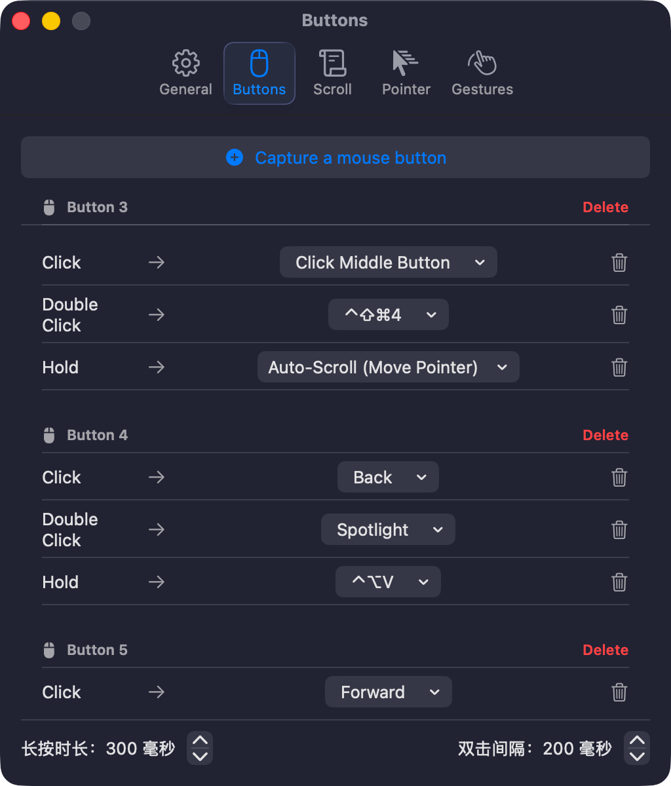
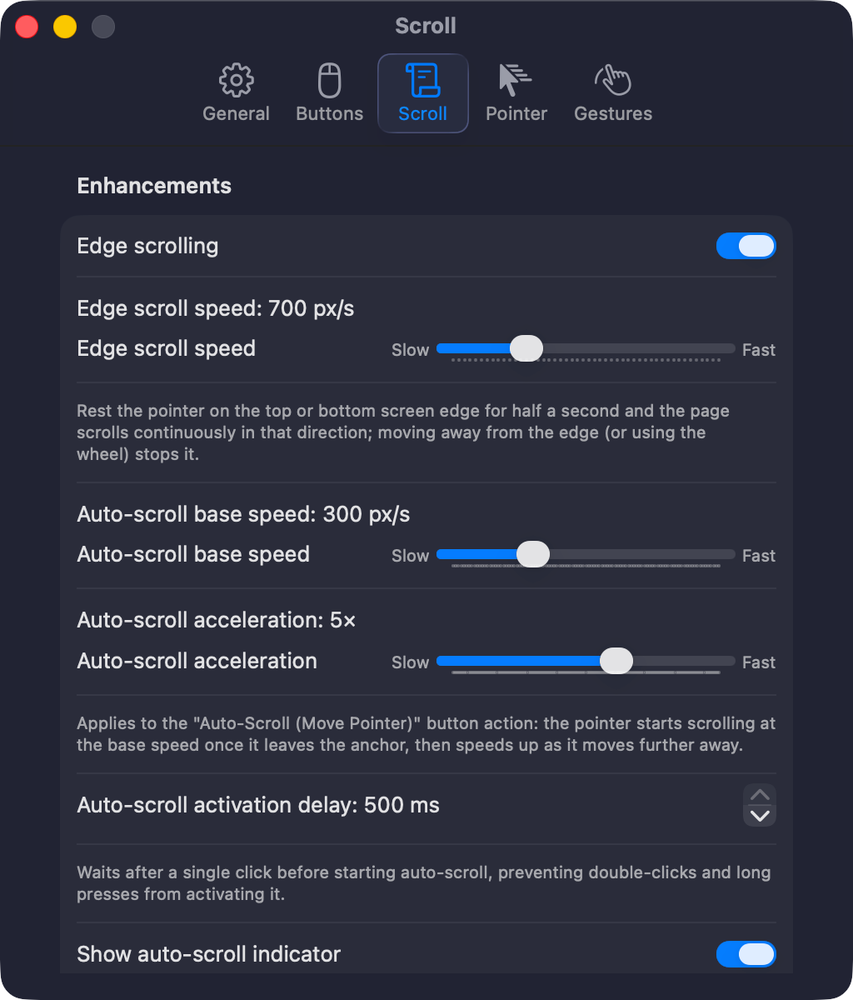
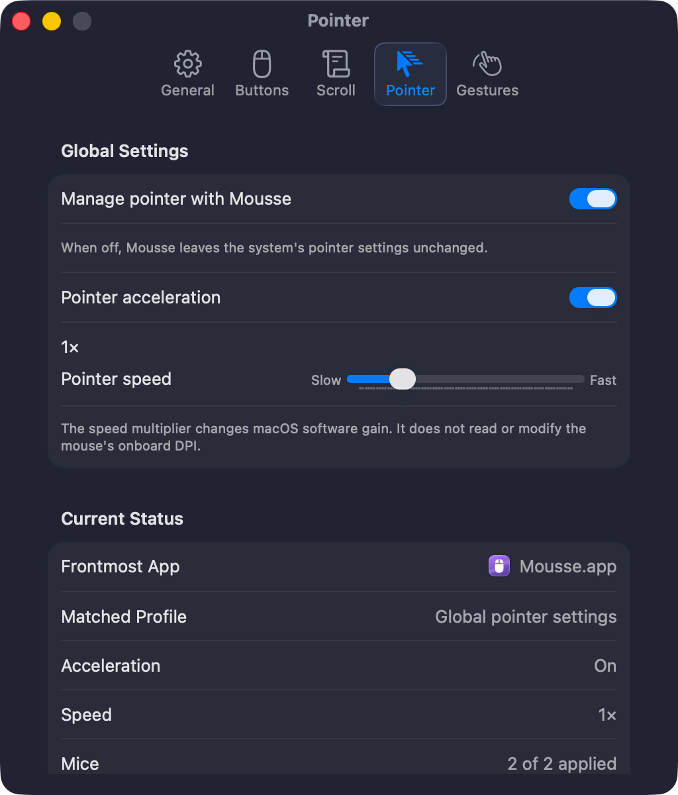

# Mousse

<p align="center">
  <b>A lightweight, single-process menu bar mouse utility for macOS.</b>
</p>

<p align="center">
  <a href="https://github.com/Souitou-iop/Mousse/releases/latest"></a>
  <a href="LICENSE.md"></a>
  
  
</p>

<p align="center">
  <b>English</b> | <a href="README_zh.md">简体中文</a> | <a href="README_ja.md">日本語</a>
</p>

---

**Mousse** is a lightweight, single-process menu bar utility for Apple Silicon Macs running macOS 15+ (Sequoia and later). It brings essential mouse enhancements to standard USB and Bluetooth mice — smooth scrolling, customizable button remapping, pointer acceleration management, Windows-style auto-scrolling, and Space-switching gestures — without background helper daemons, license servers, or system configuration tampering.

> [!NOTE]
> This repository is an enhanced fork of the original [Mousse](https://github.com/MinhQuang28/Mousse) created by **Ha Minh Quang ([@MinhQuang28](https://github.com/MinhQuang28))**.

---

## ✨ Key Enhancements in This Fork

Compared to the upstream project, this fork adds significant capabilities, performance improvements, and interface polish:

- 🎯 **Pointer Control & Acceleration Management**:
  - Independent toggle for macOS mouse acceleration (enable/disable without affecting trackpad).
  - Fine-grained pointer speed multiplier (`0.25× – 4.0×`).
  - **Per-app overrides**: Frontmost apps can inherit, enable, or disable acceleration and apply dedicated speed multipliers.
  - Live pointer diagnostics and graceful handling of external system changes without fighting system settings.
- 🧭 **Windows-Style Auto-Scroll & Edge Scrolling**:
  - **Continuous Auto-Scroll**: Enter mode via any mouse button (Middle-Click, side buttons, etc.) and move the cursor away from the anchor point to scroll continuously with 120 Hz spring smoothing and sub-pixel dispatch.
  - **Pointer Anchor Locking**: Keeps the synthetic scroll target anchored, allowing infinite, seamless scrolling in nested scroll panes (e.g. AI chat dialogs, sidebars, code editors).
  - **Single-Process HUD Indicator**: Smooth, transparent floating indicator rotating with pointer direction and refresh-rate sync (can be toggled in settings).
  - **Screen Edge Scrolling**: Hovering at the top or bottom screen edge smoothly scrolls the active window.
- 🖲️ **Expanded Button Triggers & Actions**:
  - **Multi-Trigger Recognition**: Configure **Single Click**, **Double Click** (100–500 ms interval), and **Long Press** (100–800 ms duration) per button.
  - **Smart Navigation**: Native history commands for Safari and Finder (`⌘[` / `⌘]`), standard Button 4/5 for Chromium browsers, and simulated Navigation Swipe for Apple apps.
  - **Rich Action Presets**: Spotlight Search, Siri, App Switcher (`⌘+Tab`), Smart Zoom (equivalent to trackpad 2-finger double tap), Middle-Click simulation, and custom `.app` launching.
  - **Hold-and-Scroll Volume Control**: Hold a button while scrolling the wheel to adjust volume up/down, working independently per button.
- 📜 **Refined Scrolling & Independent Zoom**:
  - **Independent Pinch-to-Zoom Speed**: `⌘ + Wheel` zoom sensitivity (`0.2× – 6.0×`) is decoupled from general scroll speed.
  - **Per-App Scroll Exceptions**: Separately enable/disable Mousse scrolling optimization and reverse scrolling for specific applications (e.g. Parallels Desktop VM passthrough).
  - **Stall-Free Smooth Scrolling**: Removed reversal brakes and transitioned to continuous phase-free event streams.
- 🌌 **Space Dragging with Pointer Freeze**:
  - Locks the pointer in place during drag-to-switch-Spaces gestures, preventing the cursor from wandering off-screen.
- 🔍 **Diagnostics Center & Configuration Management**:
  - Real-time Diagnostics panel in General settings: monitors Accessibility permissions, event-tap health, recovery counts, connected mice, frontmost app resolution, and pointer HID state.
  - **JSON Config Export & Import**: Backup, migrate, or share configurations with strict schema validation.
- 🌐 **Multilingual & Modern macOS Interface**:
  - 5 UI languages supported: **English**, **Simplified Chinese (简体中文)**, **Japanese (日本語)**, **Korean (한국어)**, and **Spanish (Español)**.
  - Dock-aware Settings window with minimize support, organized into 5 intuitive tabs: **General**, **Buttons**, **Scroll**, **Pointer**, and **Gestures**.
  - Adaptive system appearance on macOS 15 through macOS 26+.

---

## 📸 Screenshots

<p align="center">
  
  
  
</p>
<p align="center">
  <i>Buttons Mapping • Scroll & Enhancements • Pointer Acceleration Control</i>
</p>

---

## 📥 Requirements & Installation

### Requirements
- Apple Silicon Mac (`arm64`).
- macOS 15.0 (Sequoia) or later.
- **Accessibility Permission** (System Settings → Privacy & Security → Accessibility).

### Option 1: Download Pre-Built App (Recommended)
1. Download `Mousse.zip` from [Latest Releases](https://github.com/Souitou-iop/Mousse/releases/latest).
2. Unzip and drag `Mousse.app` into your `/Applications` folder.
3. Remove the Gatekeeper quarantine attribute (since the binary uses local signing):
   ```sh
   xattr -dr com.apple.quarantine /Applications/Mousse.app
   ```
4. Launch `Mousse.app` and grant Accessibility permission when prompted.

### Option 2: Build from Source
Requires Xcode Swift toolchain:
```sh
# Setup a stable local signing identity (prevents repeated Accessibility prompts)
tools/setup-signing-cert.sh

# Build the application bundle into build/Mousse.app
./build-app.sh

# Launch the app
open build/Mousse.app
```

---

## ⚙️ Configuration & Features Overview

Launch Mousse to access the menu bar icon. Press `⌘,` to open Settings:

| Tab | Key Capabilities |
| :--- | :--- |
| **General** | Launch at login, UI language switch, Live Diagnostics Center, JSON Config Export/Import. |
| **Buttons** | Capture mouse buttons, configure Single / Double / Long-press triggers, map to Shortcuts, Presets (Spotlight, Siri, App Switcher, Smart Zoom, Middle Click), Launch App, or Volume Control. |
| **Scroll** | Styles (Standard, Smooth, Smooth-step), Speed & Direction (Invert, Zoom speed), Enhancements (Auto-scroll speed/HUD, Edge scroll, High-res smoothing), Modifier keys, Per-app scroll exceptions. |
| **Pointer** | Manage macOS mouse acceleration, Pointer speed multiplier (`0.25× – 4×`), Per-app acceleration & speed overrides, live HID diagnostics. |
| **Gestures** | Drag to switch Space, drag distance threshold, Pointer freeze during drag. |

---

## 🛠 Development

```sh
# Run all unit tests (190+ test cases)
swift test

# Build and package a local release zip with sha256 checksums
tools/package-release.sh
```

---

## 🙏 Acknowledgments & Credits

- **[Ha Minh Quang (@MinhQuang28)](https://github.com/MinhQuang28)** — Original author and creator of [Mousse](https://github.com/MinhQuang28/Mousse). Sincere thanks for the clean single-process architecture, lightweight Swift event-tap foundation, and initial smooth scroll and Space gesture implementations.
- **[Noah Nuebling (@noah-nuebling)](https://github.com/noah-nuebling)** — Creator of [Mac Mouse Fix](https://github.com/noah-nuebling/mac-mouse-fix), whose `TouchSimulator` (Navigation Swipe) and `PointerFreeze` concepts provided valuable inspiration and architectural reference.

---

## 📄 License

Mousse is source-available under the [PolyForm Noncommercial License 1.0.0](LICENSE.md):
- ✅ Free for personal, non-commercial use, reading, modifying, compiling, and sharing.
- ❌ Commercial use is prohibited without a separate license from the author.

Copyright © Ha Minh Quang & Contributors.
