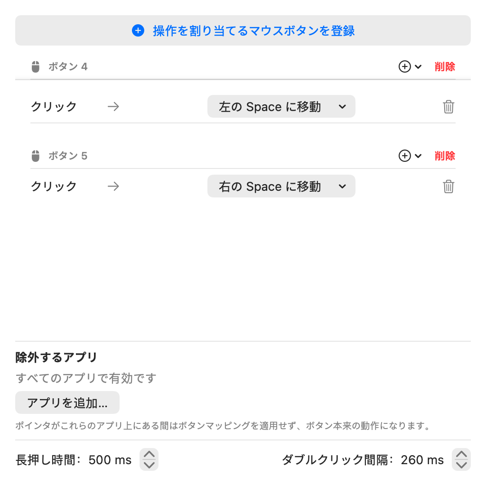
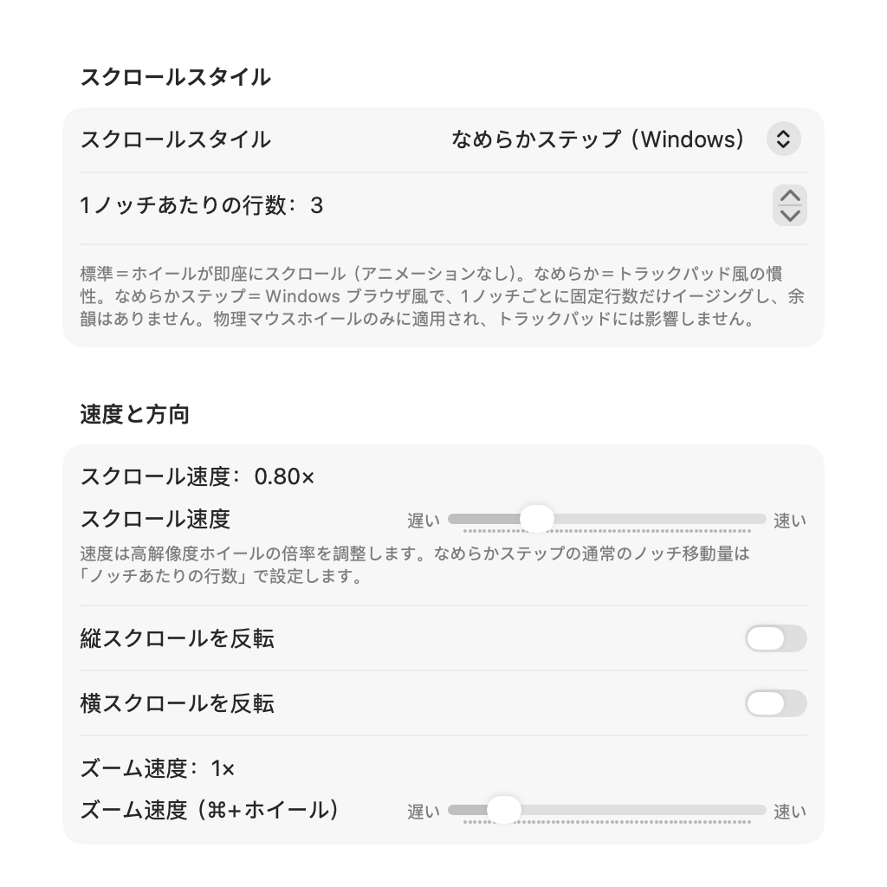
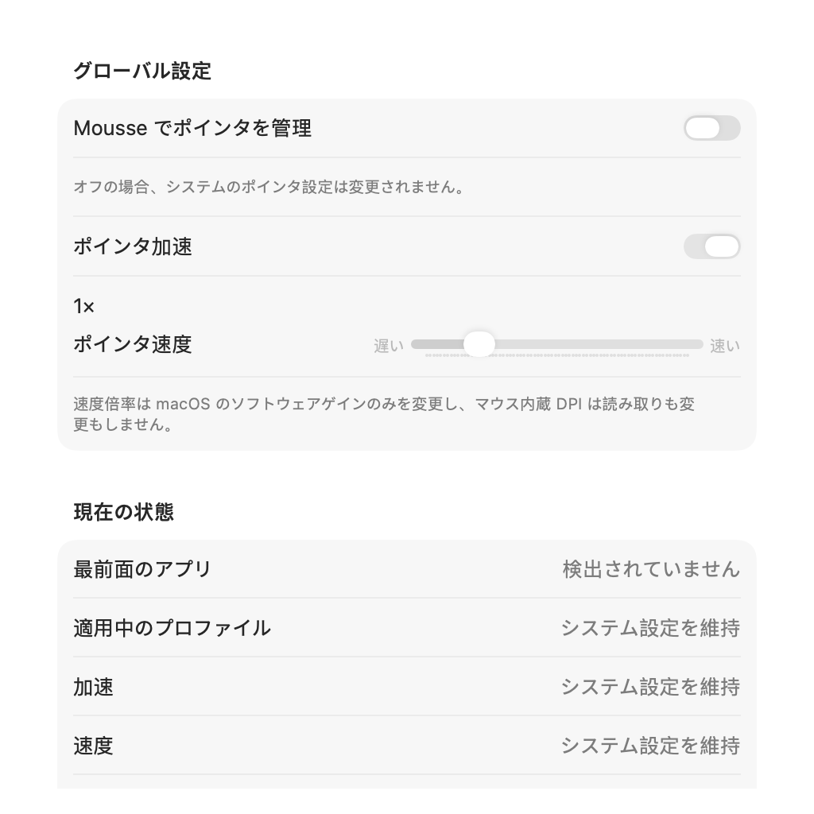
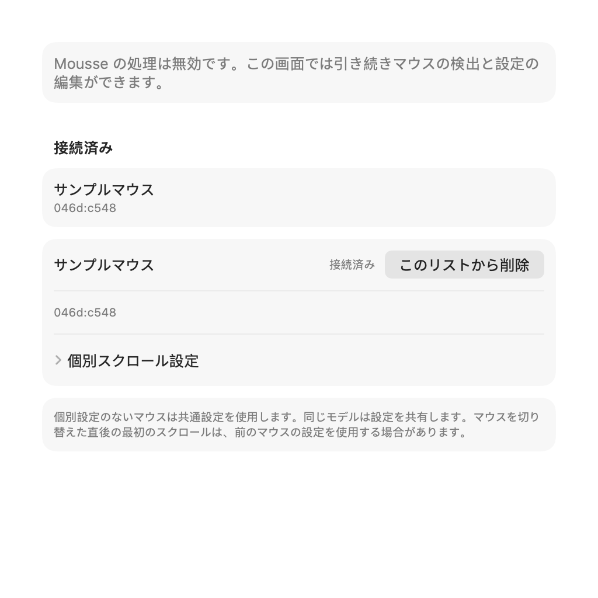

# Mousse

<p align="center">
  <b>Apple シリコン Mac および macOS 14+ 向けの軽量・単一プロセス メニューバーマウスユーティリティ。</b>
</p>

<p align="center">
  <a href="https://github.com/Souitou-iop/Mousse/releases/latest"></a>
  <a href="LICENSE.md"></a>
  
  
</p>

<p align="center">
  <a href="README.md">English</a> | <a href="README_zh.md">简体中文</a> | <b>日本語</b>
</p>

---

**Mousse** は、Apple シリコン Mac および macOS 14+ 向けに設計された、軽量・単一プロセスのメニューバー常駐型マウス拡張ユーティリティです。一般的な USB / Bluetooth マウスに、macOS 標準では提供されないなめらかなスクロール、ボタンの自由な割り当て、ポインタ加速の制御、Windows スタイルの自動スクロール、ドラッグによる Space 切り替えジェスチャを提供します。**バックグラウンドのヘルパーデーモンやライセンス認証サーバーは不要で、システム設定を不可逆的に書き換えることもありません。**

> [!NOTE]
> 本リポジトリは、**Ha Minh Quang ([@MinhQuang28](https://github.com/MinhQuang28))** 氏が作成したオリジナルプロジェクト [Mousse](https://github.com/MinhQuang28/Mousse) の機能拡張 Fork（フォーク）版です。

---

## ✨ 本 Fork の主な拡張機能

オリジナル版と比較して、本 Fork では大幅な機能強化、パフォーマンス改善、UI の刷新を行っています：

- 🎯 **ポインタ制御と加速の管理**：
  - **独立したポインタ加速スイッチ**：macOS のマウス加速を個別に有効/無効化可能（トラックパッドに影響を与えず、マウス特有のフワフワ感を解消）。
  - **ポインタ速度倍率**：`0.25× ～ 4.0×` の範囲で速度を微調整可能。
  - **アプリ別の個別設定**：最前面のアプリごとに加速のオン/オフや専用の速度倍率を個別に適用。
  - **システム設定との協調と診断**：HID 状態の変化や外部ツールによる競合を検知し、基準値を自動更新して不要な書き込み競合を防止。
- 🧭 **Windows スタイル自動スクロールとエッジスクロール**：
  - **直感的な自動スクロール**：中ボタンや任意のボタンで開始し、基準点からポインタを離すだけで連続スクロール（120 Hz スプリング平滑化とサブピクセル描画による滑らかな動作）。
  - **ポインタ固定（アンカー）機構**：イベント送信先を固定するため、AI チャットのダイアログやサイドバー、コードエディタなどの入れ子構造のスクロール領域でも外れることなく無限スクロールが可能。
  - **単一プロセス HUD インジケータ**：ポインタの移動方向に滑らかに回転し、スクロール強度をリアルタイム表示する半透明 HUD（設定で非表示も可能）。
  - **エッジスクロール**：画面の上端または下端にポインタを置くだけで、アクティブなウィンドウを自動スクロール。
- 🖲️ **豊富なボタントリガーとアクション割り当て**：
  - **多彩なトリガー判定**：各ボタンに「**クリック**」「**ダブルクリック**（100–500 ms 調整）」「**長押し**（100–800 ms 調整）」を個別に設定可能。
  - **スマートな「戻る/進む」**：Safari や Finder ではネイティブのショートカット（`⌘[` / `⌘]`）、Chromium 系ブラウザでは標準の第 4/5 ボタン、Apple 純正アプリでは Navigation Swipe ジェスチャを自動選択。
  - **豊富なシステムプリセット**：Spotlight、Siri、アプリスイッチャー（`⌘+Tab`）、スマートズーム（トラックパッドの 2 本指ダブルタップ相当）、中クリックのエミュレーションなど。
  - **アプリ起動の割り当て**：任意の `.app` を直接起動するアクションをボタンに登録可能。
  - **押しながらホイールで音量調整**：長押し中にホイールを回すことで音量を素早く調整（ボタンごとに独立して動作）。
- 📜 **スクロールの洗練と独立したズーム速度**：
  - **独立したズーム感度**：`⌘ + ホイール` によるピンチズーム感度（`0.2× ～ 6.0×`）を通常のスクロール速度から独立して設定可能。
  - **アプリ別スクロール例外**：アプリごとに Mousse スクロール最適化やスクロール方向反転を個別に切り替え可能（Parallels 等の仮想マシンでのネイティブパススルーなど）。
  - **スクロールのカクつき解消**：反転ブレーキを撤廃し、フェーズなしの連続イベントストリームを採用して途中の引っかかりを排除。
- 🌌 **ポインタ固定付き Space ドラッグジェスチャ**：
  - ボタンを押しながら左右にドラッグして Space を切り替える際、**ポインタの位置を固定（Pointer Freeze）** してカーソルが画面外へ流れるのを防止。
- 🔍 **診断センターと設定ファイルの書き出し/読み込み**：
  - 「一般」タブに**リアルタイム診断パネル**を搭載。アクセシビリティ権限、イベントタップの稼働状態、接続中のマウス台数、ポインタ下のアプリ、HID 状態を一目で確認可能。
  - **JSON 設定の書き出し/読み込み**：バックアップや別の Mac への設定移行が容易。厳格なスキーマ検証を実装。
- 🌐 **多言語対応と最新 macOS への適応**：
  - **日本語**、**English**、**简体中文**、**한국어**、**Español** の 5 言語に対応（システム言語への自動追従または手動切り替え）。
  - 設定を開くと Dock アイコンが表示され最小化に対応し、閉じると自動的にメニューバー専用に戻る仕様。設定画面は「**一般**」「**ボタン**」「**スクロール**」「**ポインタ**」「**ジェスチャ**」の 5 タブ構成。
  - 外観はシステムに自動適応：macOS 14 / 15 は標準スタイル、macOS 26+ は新しい外観（Liquid Glass）。

---

## スクロールモード・デバイス設定・互換性

- **Native** は元のホイールイベントを保持し、デバイス/共通の縦・横方向反転のみ適用します。Mousse の速度倍率、平滑化、Cmd ズーム、Shift/Option/Control 拡張、通常のアプリ別方向・軸変換は使いません。トラックパッドの位相付きスクロールと安全な除外は維持します。明示的なボタン割り当て、自動・端スクロール、ボタンを押しながらホイールで行う音量操作は利用できます。
- **Standard** の既存動作を残し、古い `standard` / `smoothScroll:false` を Native に移行しません。**Smooth** は平滑度と加速を設定でき、**Smooth-step** の通常ノッチ移動量はノッチあたりの行数で決まります。
- Native 以外は速度と Cmd ズーム速度を設定できます。Standard/Smooth-step の速度は**高解像度ホイールの倍率**に作用し、通常ノッチの距離は変えません（Standard は macOS、Smooth-step は行数が制御）。高解像度の平滑化は Smooth/Smooth-step のみです。無効なコントロールを隠しても保存値は失われません。
- デバイスタブでは共通設定からプロファイルを作成し、未接続のプロファイルも編集・削除できます。USB/Bluetooth の `vendor:product` をキーにし、同じモデルは設定を共有します。HID と CGEvent の順序は保証されないため、**マウス切り替え後の最初のスクロールは前の設定を使う場合があります**。
- 通常モードの優先順位は低い順に **デバイス/共通の基本設定 → 明示的なアプリ設定 → 安全な強制パススルー**。端末、iPhone ミラーリングの元イベント、設定されたリモートデスクトップ/ゲーム除外を優先します。Native は通常のアプリ設定を無視しますが、安全規則は維持します。
- デバイス識別には**入力監視の許可**が必要です。識別できない場合は共通基本設定に戻り、既存の権限ゲートが処理を停止する場合もあります。追跡は `(有効かつプロファイルあり) または デバイスタブが実際に表示中` の場合だけ動作します。Mousse が無効でも画面から検出できます。タブ切り替え、ウインドウ閉鎖・最小化・非表示、App Hide で画面の要求を解除し、要求がなければ追跡と再試行を止めます。必要な間は権限回復を再試行し、アプリの再起動は不要です。
- スクロール文脈が変わると、前の慣性とまだ実行されていないズームタスクを解除します。実行を開始した down/up の組は最後まで完了し、取り消しません。

これはソース実装と自動回帰テストの説明です。**実 HID 切り替え、スリープ復帰、iPhone ミラーリング、長時間のメモリ安定性の実機検証済みという意味ではありません**。

## 📸 スクリーンショット

<p align="center">
  
  
  
  
</p>
<p align="center">
  <i>ボタン割り当て • スクロールと拡張機能 • ポインタ加速と速度管理</i>
</p>

> 隔離 XCTest + NSHostingView/AppKit で実 SwiftUI ソースから描画した設定内容プレビュー（ネイティブのウインドウツールバーを除く）です。デバイス名・データは例であり、実 HID の受け入れ検証画面ではありません。無効状態の一時設定と偽の追跡器を使用し、アプリ本体やイベント tap は起動しません。

---

## 📥 動作環境とインストール

### 動作環境
- Apple シリコン Mac（`arm64`）。
- macOS 14.0 以降。
- **アクセシビリティ権限**（システム設定 → プライバシーとセキュリティ → アクセシビリティ）。

> [!NOTE]
> システムバージョン差：逆方向ドラッグで Mission Control / App Exposé を自然に閉じる動作はオーバーレイ状態を検出できる macOS 26+ 限定で、macOS 14 / 15 では従来の 1 Space ずつのトグルになります。なめらかなスクロール、ボタン割り当て、ポインタ加速の制御、自動スクロール、指追従の Space 切り替え、ピンチズーム合成は同一の動作です。

### 方法 1：ビルド済みアプリのダウンロード（推奨）
1. [最新リリース](https://github.com/Souitou-iop/Mousse/releases/latest) から `Mousse.zip` をダウンロードします。
2. 解凍して `Mousse.app` を「**アプリケーション**」フォルダにドラッグ＆ドロップします。
3. ローカル署名のため、以下のコマンドで Gatekeeper の隔離属性を解除します：
   ```sh
   xattr -dr com.apple.quarantine /Applications/Mousse.app
   ```
4. `Mousse.app` を起動し、画面の指示に従ってアクセシビリティ権限を許可します。

### 方法 2：ソースコードからビルド
Xcode の Swift ツールチェーンが必要です：
```sh
# ローカル署名証明書を作成（リビルド時のアクセシビリティ再要求を防止）
tools/setup-signing-cert.sh

# アプリケーションを build/Mousse.app にビルド
./build-app.sh

# 起動
open build/Mousse.app
```

---

## ⚙️ 設定タブと主な機能一覧

Mousse を起動後、メニューバーのアイコンをクリックするか `⌘,` を押して設定画面を開きます：

| タブ | 主な機能 |
| :--- | :--- |
| **一般 (General)** | ログイン時起動、UI 言語切り替え、リアルタイム診断パネル、設定 JSON の書き出し/読み込み。 |
| **ボタン (Buttons)** | マウス物理ボタンの登録、クリック / ダブルクリック / 長押しのトリガー設定、カスタムショートカット、システムプリセット（Spotlight、Siri、アプリスイッチャー、スマートズーム、中クリック）、アプリ起動、ホイール音量調整。 |
| **スクロール (Scroll)** | スクロールスタイル（Native、標準、なめらか、なめらかステップ）、速度と方向反転、⌘+ホイールズーム速度、自動スクロール設定と HUD 表示、エッジスクロール、高解像度マウス最適化、アプリ別例外。 |
| **ポインタ (Pointer)** | macOS マウス加速の管理、ポインタ速度倍率（`0.25× ～ 4×`）、アプリごとの加速・速度上書き、HID 診断。 |
| **デバイス (Devices)** | モデル別スクロール設定、縦横反転、接続・未接続プロファイル編集、共通設定へのフォールバック。 |
| **ジェスチャ (Gestures)** | ドラッグによる Space 切り替え、切り替え距離の調整、ドラッグ中のポインタ固定。 |

---

## 🤖 Agent 向け CLI

Mousse には、スクリプトや AI Agent 向けのローカル CLI があり、結果を JSON で返します。使用前に Mousse を起動しておく必要があり、CLI が別のインスタンスを起動することはありません。主なコマンド：

```sh
Mousse status
Mousse diagnostics
Mousse get scrollMode
Mousse set scrollMode smooth
Mousse set scrollSpeed 0.5
```

Agent はプロセスの終了コードと JSON の `ok` フィールドの両方を確認してください。`Mousse help` では、そのビルドで利用できるコマンドと設定キーの制約を確認できます。呼び出し手順、戻り値、設定値、プロトコル、安全ルールの詳細は[Agent 向け CLI ガイド](docs/cli-for-agents.md)を参照してください。

## 🛠 開発とテスト

```sh
# 単体テストスイートを実行（190以上のテストケース）
swift test

# ローカル配布用 Release パッケージ（zip + sha256）を作成
tools/package-release.sh
```

---

## 🙏 謝辞とクレジット

- **[Ha Minh Quang (@MinhQuang28)](https://github.com/MinhQuang28)** 氏 — [Mousse](https://github.com/MinhQuang28/Mousse) オリジナル版の開発者。無駄のない単一プロセス設計、軽量な Swift Event Tap 基盤、初期のスクロールとジェスチャ実装に心より感謝申し上げます。
- **[Noah Nuebling (@noah-nuebling)](https://github.com/noah-nuebling)** 氏 — [Mac Mouse Fix](https://github.com/noah-nuebling/mac-mouse-fix) の作者。Navigation Swipe（TouchSimulator）や PointerFreeze の設計思想は、本プロジェクトの実装において大変有益な参考となりました。

---

## 📄 ライセンス

Mousse は [PolyForm Noncommercial License 1.0.0](LICENSE.md) に基づいて公開されています：
- ✅ 個人による非商用利用、コードの閲覧、改変、自己ビルド、無償での共有が許可されています。
- ❌ 原著作者の許可なく、商用製品への組み込み、販売、有料アクセスなどの商用利用は禁止されています。

Copyright © Ha Minh Quang & Contributors.
