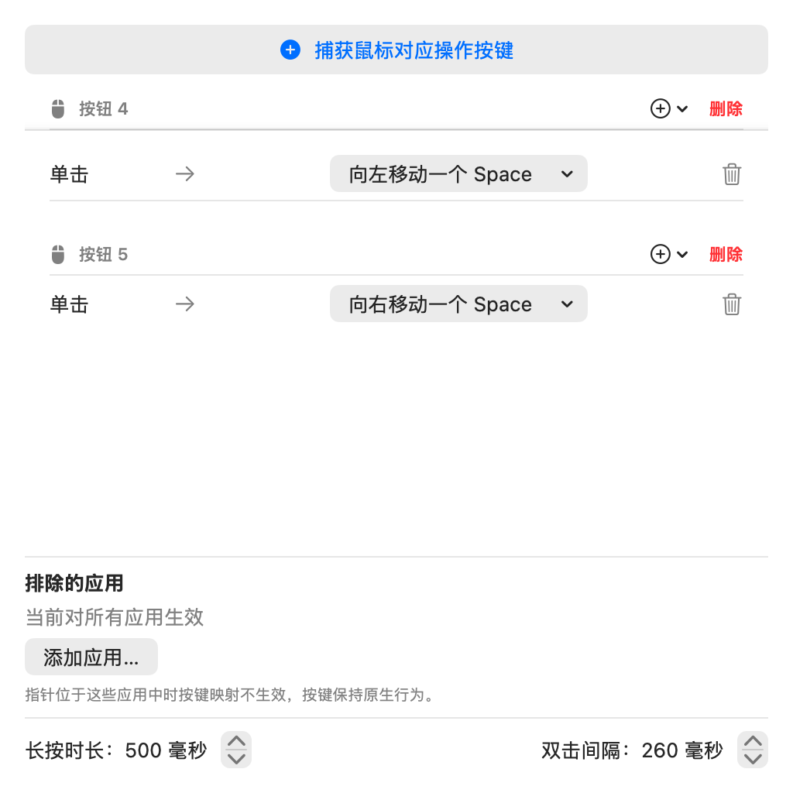
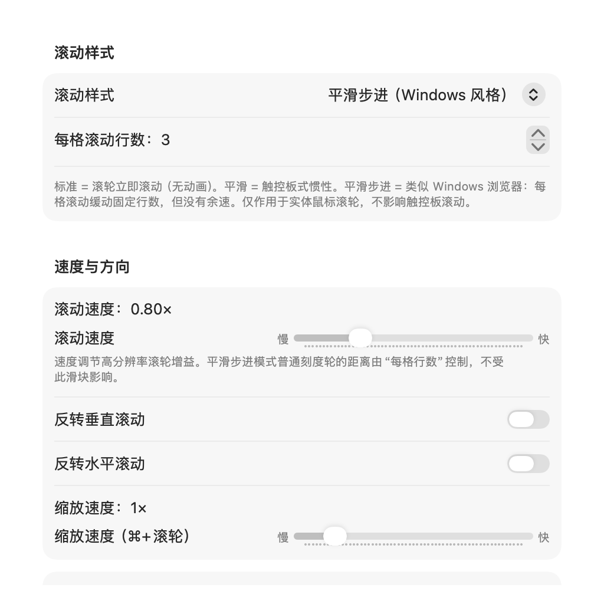
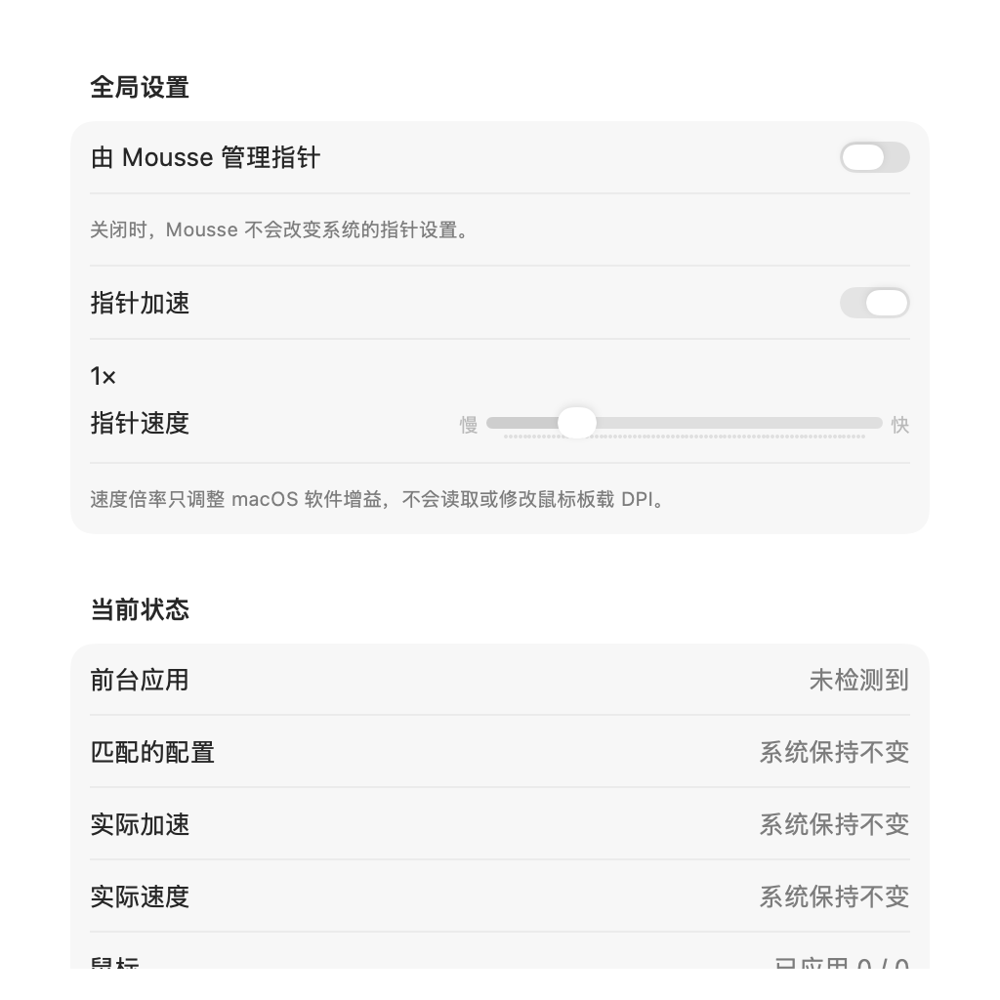
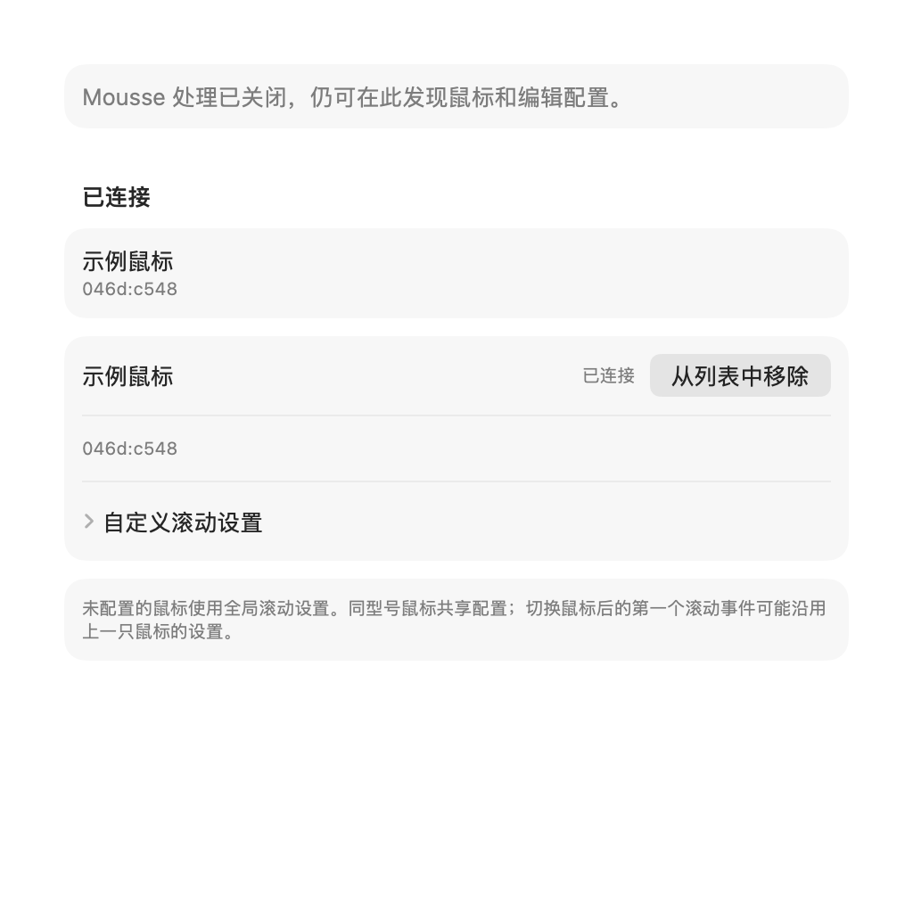

# Mousse

<p align="center">
  <b>面向 Apple 芯片与 Intel Mac、macOS 14+ 的轻量级、单进程菜单栏鼠标增强工具。</b>
</p>

<p align="center">
  <a href="https://github.com/Souitou-iop/Mousse/releases/latest"></a>
  <a href="LICENSE.md"></a>
  
  
</p>

<p align="center">
  <a href="README.md">English</a> | <b>简体中文</b> | <a href="README_ja.md">日本語</a>
</p>

---

**Mousse** 是一款专为 Apple 芯片与 Intel Mac、macOS 14+ 设计的轻量级、单进程菜单栏鼠标增强工具。它为普通 USB 和蓝牙鼠标补齐了 macOS 原生缺失的核心体验：平滑滚动、按键动作重映射、指针加速度接管、Windows 风格自动滚动以及拖拽切换 Space 手势，且**无需后台常驻 Daemon 辅助进程、无需许可证联网验证、无需破坏性修改系统底层配置**。

> [!NOTE]
> 本仓库为 **Ha Minh Quang ([@MinhQuang28](https://github.com/MinhQuang28))** 原项目 [Mousse](https://github.com/MinhQuang28/Mousse) 的增强 Fork 版本。

---

## ✨ 本 Fork 核心增强特性

相比原版项目，本 Fork 进行了大量深度重构与功能拓展：

- 🎯 **指针控制与加速度管理**：
  - **独立加速度开关**：可单独开启或关闭 macOS 鼠标加速度（消除鼠标飘浮感，且不影响触控板）。
  - **指针速度倍率**：支持 `0.25× – 4.0×` 精细速度调节。
  - **按应用独立覆盖**：可按当前前台应用单独继承、开启或关闭加速度，并设置专属速度倍率。
  - **系统设置协调与诊断**：实时检测 HID 状态变化与外部漂移，自动同步基准而不反复抢写冲突。
- 🧭 **Windows 风格自动滚动与边缘滚动**：
  - **原生级自动滚动**：通过中键或任意鼠标按键触发，光标偏离锚点即可驱动页面持续滚动；采用 120 Hz 弹簧平滑与子像素渲染，丝滑流畅。
  - **指针锚定机制**：进入自动滚动时锁定事件派发锚点，完美解决 AI 对话框、侧边栏、代码编辑器等嵌套滚动区域移出失效的问题。
  - **单进程 HUD 指示器**：低侵入半透明光标 HUD，跟随鼠标方向平滑旋转并实时指示滚动强度（支持在设置中关闭）。
  - **屏幕边缘滚动**：光标悬停在屏幕顶部或底部边缘时自动平滑滚动当前窗口。
- 🖲️ **丰富按键触发与动作映射**：
  - **多触发机制**：每个按键均可独立分配**单击**、**双击**（100–500 ms 判定）与**长按**（100–800 ms 判定）。
  - **智能前进/后退**：Safari 与 Finder 采用原生历史快捷键（`⌘[` / `⌘]`），Chromium 浏览器发送标准 Button 4/5，Apple 原生应用触发 Navigation Swipe 滑动手势。
  - **丰富系统级预设**：支持聚焦搜索（Spotlight）、Siri、应用切换器（`⌘+Tab`）、智能缩放（等价触控板双指双击）、模拟中键点击等。
  - **启动任意应用**：按键动作可绑定启动任意指定的 `.app`。
  - **按住滚动调整音量**：长按指定按键并滚动滚轮即可快速增减音量，且支持按按键独立生效。
- 📜 **精细化滚动与独立缩放**：
  - **独立缩放速度**：`⌘ + 滚轮` 缩放灵敏度（`0.2× – 6.0×`）与普通滚动速度解耦，可独立调节。
  - **按应用例外控制**：每个应用可独立控制是否启用 Mousse 滚动优化与反向滚动（例如在 Parallels 虚拟机中直通原生事件）。
  - **彻底告别滚动卡顿**：移除反向刹车限制，采用无相位连续事件流，杜绝页面中途卡顿。
- 🌌 **Space 拖拽手势增强**：
  - 拖拽切换 Space 期间支持**光标原地锁定（Pointer Freeze）**，避免手势操作时光标移出屏幕可视范围。
- 🔍 **诊断中心与配置导入导出**：
  - 常规页面内置**实时诊断面板**，一览辅助功能权限、事件监听健康度、已连接鼠标数、前台应用以及指针 HID 状态。
  - **配置 JSON 导入/导出**：方便备份、跨机迁移与分享，具备严格的格式校验。
- 🌐 **五国语言与现代 macOS 外观**：
  - 支持 **简体中文**、**English**、**日本語**、**한국어**、**Español**（随系统自动切换或手动指定）。
  - 打开设置时显示 Dock 图标并支持窗口最小化，关闭后自动退出 Dock 恢复纯菜单栏模式；界面划分为**常规**、**按钮**、**滚动**、**指针**、**手势** 5 大页面。
  - 外观随系统自适应：macOS 14 / 15 保持系统原生样式，macOS 26+ 自动采用 Liquid Glass 等新外观。

---

## 滚动模式、设备配置与兼容边界

- **原生 Native** 保留滚轮原事件，仅应用设备/全局的垂直与水平反转。不运行 Mousse 滚轮速度增益、平滑、Cmd 缩放、Shift/Option/Control 增强或普通应用方向/轴转换规则。触控板相位滚动及安全绕过保持不变；明确触发的按钮映射、自动/边缘滚动及按住按钮滚轮调音量仍可使用。
- **标准 Standard** 保留旧行为，旧 `standard` 与 `smoothScroll:false` 配置不迁移到 Native。**平滑 Smooth** 支持平滑度和加速；**平滑步进 Smooth-step** 通过“每格行数”决定普通刻度轮距离。
- 所有非 Native 模式都可调速度与 Cmd 缩放速度。Standard/Smooth-step 的速度作用于**高分辨率滚轮增益**，不改变普通刻度轮距离：Standard 由系统决定，Smooth-step 由每格行数决定。高分辨率平滑仅用于两种平滑模式；隐藏无效控件不会删除其保存值。
- 设备页可从当前全局设置创建配置、编辑离线配置、删除配置。键为 USB/Bluetooth `vendor:product`，**同型号共享配置**。HID 与 CGEvent 没有顺序保证，**切换鼠标后的第一个滚动事件可能使用上一只鼠标的配置**。
- 普通模式的优先级从低到高为：**设备/全局基础 → 应用显式覆盖 → 安全硬直通**。应用覆盖控制方向和是否运行 Mousse 增强；终端硬直通、iPhone 镜像原事件、配置的远程桌面/游戏绕过保持优先。Native 忽略普通应用覆盖，但保留安全规则。
- 设备识别需要**输入监控权限**。无法归属设备时，基础解析回退全局设置，既有权限门禁也可能暂停处理。追踪器仅在 `(启用且有设备配置) 或 设备页实际可见` 时运行：关闭 Mousse 仍可在设备页发现鼠标。切 tab、关窗、最小化/隐藏窗口及 App Hide 撤销页面需求；无需求时停止追踪与权限重试，有需求时授权恢复无需重启应用。
- 切换滚动上下文会清理上一上下文的惯性和尚未执行的排队缩放任务；已获准开始的 down/up 对必须完整结束，不能被撤回。

以上是源码实现和自动化回归覆盖，**不代表真实 HID 切换、唤醒恢复、iPhone 镜像或长期内存稳定性已经验收**；这些仍需独立运行验证。

## 📸 界面预览

<p align="center">
  
  
  
  
</p>
<p align="center">
  <i>按键动作映射 • 滚动与增强设置 • 指针与加速度管理</i>
</p>

> 以上为隔离 XCTest + NSHostingView/AppKit 从真实 SwiftUI 源码渲染的设置内容预览（不含原生窗口工具栏）。设备名称与数据为示例，非实时 HID 验收截图；使用禁用状态的临时配置和假追踪器，不启动完整应用或事件 tap。

---

## 📥 系统要求与安装

### 系统要求
- Apple 芯片（`arm64`）或 Intel（`x86_64`）Mac。
- macOS 14.0 或更高版本。
- **辅助功能权限**（系统设置 → 隐私与安全性 → 辅助功能）。

每个版本按架构分别提供两个压缩包 —— `Mousse-<version>-arm64.zip` 与 `Mousse-<version>-x86_64.zip`。请先在苹果菜单 → **关于本机**（芯片 / 处理器）确认自己的架构再下载对应包；下错架构无法启动。

> [!NOTE]
> 系统版本差异：反向拖拽自然关闭 Mission Control / App Exposé 依赖 macOS 26+ 的覆盖层状态检测，在 macOS 14 / 15 上纵向拖拽保留原来的每次一格切换；平滑滚动、按键重映射、指针加速接管、自动滚动、跟手切换 Space 与捏合缩放合成等行为一致。Intel 支持为本版本新增，指针接管的 IOHID 通路尚未在 Intel 真机上完成验收。

### 方式一：下载预构建应用（推荐）
1. 从 [最新发布页面](https://github.com/Souitou-iop/Mousse/releases/latest) 下载与你机器匹配的 `Mousse-<version>-arm64.zip` 或 `Mousse-<version>-x86_64.zip`。
2. 解压并将 `Mousse.app` 拖入 **应用程序 (Applications)** 文件夹。
3. 移除 macOS Gatekeeper 隔离标记（由于采用本地签名）：
   ```sh
   xattr -dr com.apple.quarantine /Applications/Mousse.app
   ```
4. 运行 `Mousse.app` 并在弹出提示中授予辅助功能权限。

### 方式二：从源码编译
需要 Xcode Swift 工具链：
```sh
# 创建本地稳定签名证书（避免重新编译后重复提示授权辅助功能）
tools/setup-signing-cert.sh

# 按架构分别产出 build/Mousse-arm64.app 与 build/Mousse-x86_64.app
./build-app.sh

# 启动应用（选择与你机器架构一致的包）
open build/Mousse-arm64.app
```

---

## ⚙️ 设置与功能页面一览

启动 Mousse 后点击菜单栏图标，或按下快捷键 `⌘,` 打开设置窗口：

| 标签页 | 核心功能 |
| :--- | :--- |
| **常规 (General)** | 登录时启动、界面语言切换、实时诊断面板、配置 JSON 导入与导出。 |
| **按钮 (Buttons)** | 捕获鼠标物理按键，配置单击 / 双击 / 长按触发方式，映射为自定义快捷键、系统预设（聚焦搜索、Siri、应用切换器、智能缩放、模拟中键）、打开指定 App 或滚动调音量。 |
| **滚动 (Scroll)** | 滚动模式（原生、标准、平滑、平滑步进）、滚动速度与反转、⌘+滚轮缩放速度、自动滚动参数与 HUD 开关、边缘滚动、高分辨率鼠标平滑、按应用例外。 |
| **指针 (Pointer)** | macOS 鼠标加速度接管、全局指针速度倍率（`0.25×–4×`）、按前台应用独立覆盖加速与速度、HID 状态诊断。 |
| **设备 (Devices)** | 按型号滚动配置、分轴反转、连接/离线配置编辑、全局回退。 |
| **手势 (Gestures)** | 按住按键拖拽切换 Space、切换灵敏度距离设定、拖拽期间锁定鼠标指针。 |

---

## 🤖 面向 Agents 的 CLI

Mousse 提供了一个面向脚本和 AI Agents 的本地 CLI，并以 JSON 输出结果。使用前必须先启动 Mousse；CLI 不会额外启动第二个实例。常用命令：

```sh
Mousse status
Mousse diagnostics
Mousse get scrollMode
Mousse set scrollMode smooth
Mousse set scrollSpeed 0.5
```

Agent 应同时检查进程退出码和 JSON 中的 `ok` 字段。`Mousse help` 会输出当前版本的命令和配置键约束。详细的调用流程、返回值、支持的配置值、协议和安全规则请参阅[面向 Agents 的 CLI 使用指南](docs/cli-for-agents.md)。

## 🛠 本地开发与测试

```sh
# 执行完整单元测试套件
swift test

# 打包本地 Release 发布包并生成 sha256 校验和
tools/package-release.sh
```

---

## 🙏 致谢与致敬

- **[Ha Minh Quang (@MinhQuang28)](https://github.com/MinhQuang28)** — [Mousse](https://github.com/MinhQuang28/Mousse) 原项目的创作者与原作者。衷心感谢其构建的优雅单进程架构、轻量级 Swift Event Tap 事件基础以及初代平滑滚动与手势实现。
- **[Noah Nuebling (@noah-nuebling)](https://github.com/noah-nuebling)** — [Mac Mouse Fix](https://github.com/noah-nuebling/mac-mouse-fix) 的创作者，其 `TouchSimulator`（Navigation Swipe 导航手势）与 `PointerFreeze` 设计思想为本项目的相关实现提供了重要的启发与参考。

---

## 📄 许可证

Mousse 遵循 [PolyForm Noncommercial License 1.0.0](LICENSE.md) 协议开源：
- ✅ 允许个人非商业使用、学习源码、修改代码、自行编译及免费分享。
- ❌ 未经原作者许可，严禁用于任何商业产品、销售或收费服务。

Copyright © Ha Minh Quang 与贡献者。
